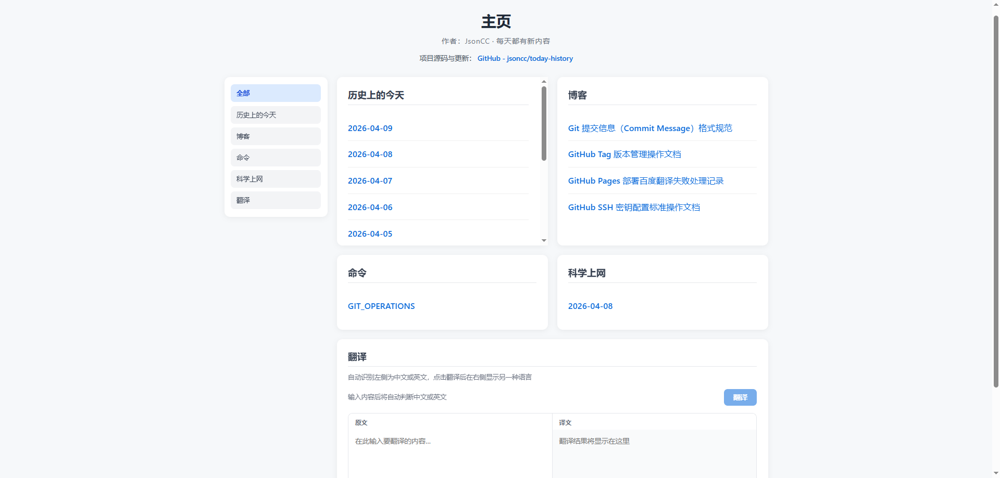

# today-history

一个基于 Vue 3 + Vite 的静态站点，用于维护和展示：

- 历史上的今天（按日期 Markdown）
- 博客文档（Markdown）
- 命令文档（Markdown）
- VPN 记录（Markdown）
- 中英文翻译工具（百度翻译 API）
- 左侧模块导航（支持「全部 / 单模块」切换）

在线地址：<https://jsoncc.github.io/today-history/>

---

## 技术栈

- `vue@3`
- `vite@5`
- `marked`（Markdown 渲染）
- `crypto-js`（百度翻译签名 MD5）
- GitHub Actions + GitHub Pages（自动部署）

---

## 目录结构

```text
.
├─ generate-blog-meta.mjs      # 生成博客更新时间元数据（基于 Git 提交时间）
├─ src/
│  ├─ App.vue
│  ├─ App.css
│  ├─ components/
│  │  └─ MarkdownViewer.vue
│  └─ assets/
│     ├─ history/      # 历史内容：history-YYYY-MM-DD.md
│     ├─ blog/         # 博客内容：*.md
│     │  └─ blog-meta.json     # 自动生成：博客更新时间（path -> unix 时间戳）
│     ├─ command/      # 命令文档：*.md
│     ├─ vpn/          # VPN 文档：*.md
│     └─ images/       # Markdown 内图片资源
├─ workers/
│  ├─ baidu-proxy.js   # Cloudflare Worker 转发百度翻译接口
│  └─ wrangler.toml
├─ .github/workflows/
│  └─ deploy.yml       # GitHub Pages 部署流程
├─ vite.config.js
└─ .env.example
```

---

## 本地开发

### 1) 安装依赖

```bash
npm install
```

### 2) 配置环境变量

复制 `.env.example` 为 `.env`，填写：

```env
VITE_BAIDU_APP_ID=你的百度翻译APP_ID
VITE_BAIDU_SECRET=你的百度翻译密钥
# 可选：本地通常不填。若你要本地模拟生产，可填 Worker 地址
# VITE_BAIDU_TRANSLATE_URL=https://xxx.workers.dev
```

### 3) 启动

```bash
npm run dev
```

> `npm run dev` / `npm run build` 前会自动执行 `generate-blog-meta.mjs`，用于刷新博客更新时间排序数据。

---

## 首页导航改版后



---

## 翻译模块说明（百度翻译）

### 请求链路

- 开发环境：前端请求 `/baidu-fanyi`，由 Vite 代理到百度接口
- 生产环境（GitHub Pages）：前端请求 `VITE_BAIDU_TRANSLATE_URL`（建议 Cloudflare Worker），再由 Worker 转发到百度接口

### 为什么生产要 Worker

GitHub Pages 是纯静态托管，无法使用 Vite 代理；浏览器也不能直接跨域调用百度翻译 API，所以必须有一个可访问的转发层。

### Worker 快速部署

```bash
cd workers
npx wrangler login
npx wrangler deploy
```

部署后拿到 `https://xxx.workers.dev`，用于配置 `VITE_BAIDU_TRANSLATE_URL`。

---

## GitHub Pages 自动部署

推送到 `main` 后，`.github/workflows/deploy.yml` 会自动构建并发布。

请在仓库 `Settings -> Secrets and variables -> Actions` 配置：

- `VITE_BAIDU_APP_ID`
- `VITE_BAIDU_SECRET`
- `VITE_BAIDU_TRANSLATE_URL`（Worker 地址）

---

## 内容维护规则

### 历史内容

- 目录：`src/assets/history/`
- 文件名：`history-YYYY-MM-DD.md`（例如 `history-2026-04-07.md`）
- 首页会自动按日期倒序读取并展示

### 博客 / 命令 / VPN

- 目录分别为：
  - `src/assets/blog/`
  - `src/assets/command/`
  - `src/assets/vpn/`
- 文件名使用可读名称（`.md`）
- 首页自动扫描并展示
- 博客列表按“文档最后一次 Git 提交时间”倒序显示（最新更新在最上）
- 科学上网模块在左侧切换到单模块时，会直接展示最新一篇文档正文

### 首页导航说明

- 左侧导航支持切换：
  - `全部`：展示所有模块
  - `历史上的今天 / 博客 / 命令 / 科学上网 / 翻译`：只展示对应模块
- 在单模块模式下，卡片高度会提升到接近视口高度，便于阅读长内容

### Markdown 图片引用（项目内相对路径）

- 图片放到：`src/assets/images/...`
- 在 Markdown 中引用：`./images/...`
- 示例：``

项目内已对 Markdown 图片路径做解析，便于在本地与打包后显示。

---

## 常用命令

```bash
# 开发
npm run dev

# 构建
npm run build

# 预览构建产物
npm run preview

# 手动刷新博客更新时间元数据（一般不需要，dev/build 会自动执行）
node generate-blog-meta.mjs
```

---

## 安全提示

- `.env` 不要提交到仓库
- `.env.example` 仅保留变量名，不放真实密钥
- 若密钥曾在公开渠道泄露，请立即在百度翻译开放平台重置